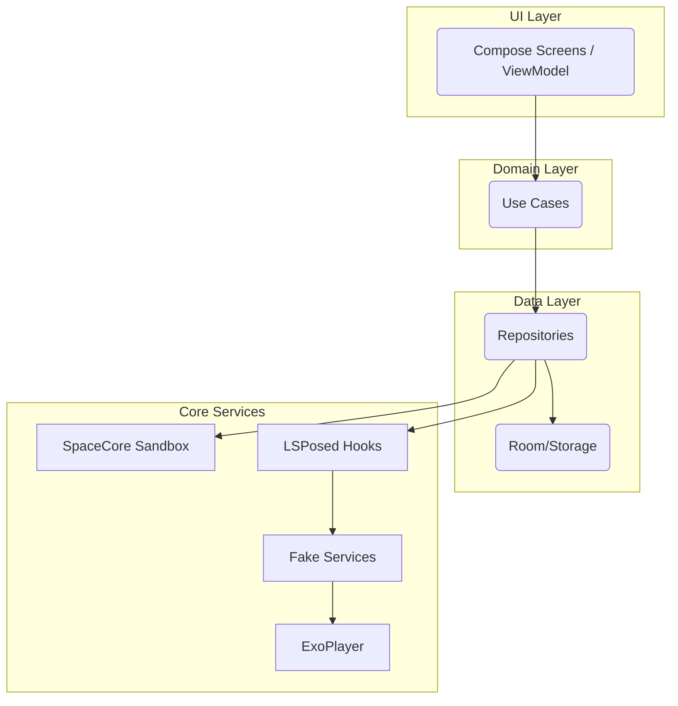

# vCamera 4.0 Development Plan

_This document outlines the major design goals and architecture for the next generation of the vCamera project. It is adapted from a broader proposal with the virtualization engine changed from **BlackBox** to **SpaceCore**._

## 1. Executive Summary

vCamera 4.0 aims to rebuild the application with modern Android technologies. The new version will provide advanced virtualization features, improved privacy protections, and a modular code base. The virtualization stack is based on **SpaceCore**, enabling sandboxing and app cloning capabilities.

## 2. Architecture Overview

The system follows a multi-layer design inspired by Clean Architecture:

1. **UI Layer** – Implemented entirely with Jetpack Compose and ViewModels.
2. **Domain Layer** – Contains pure Kotlin use cases defining business logic.
3. **Data Layer** – Provides repositories backed by Room or local storage.
4. **Core Services Layer** – Integrates the core engines:
   - **Virtualization Engine:** SpaceCore
   - **Hooking Engine:** LSPosed (via non‑root solutions)
   - **Media Engine:** ExoPlayer for delivering frames to the fake camera service
   - **Fake Services:** Custom modules for camera and GPS data

A simple diagram illustrates these layers:

## 3. Development Roadmap

1. **Proof of Concept**
   - Create a minimal multi‑module project.
   - Integrate SpaceCore to clone and launch a simple app.
   - Demonstrate a basic LSPosed hook.
2. **MVP Features**
   - List installed apps and allow cloning into SpaceCore.
   - Provide a basic fake camera (static image) and fake GPS service.
3. **Feature Expansion**
   - Support video sources via ExoPlayer for the virtual camera.
   - Allow route simulation for GPS.
   - Improve user interface following Material 3 guidelines.
4. **Testing and Optimization**
   - Perform extensive QA on multiple Android versions.
   - Optimize performance and implement anti‑detection techniques.
5. **Release**
   - Configure CI/CD with Gradle and GitHub Actions.
   - Ship signed APKs/AABs and provide documentation.

## 4. Notes

This plan replaces all references to the BlackBox SDK with **SpaceCore**. Additional details, such as repository structure and exact module names, can be refined as development progresses.
